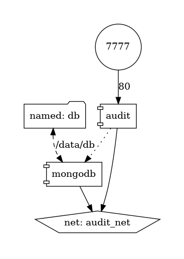

# audit   
Audit of Objects as a service. It's not the best concept, even, it might be an antipattern of Event Sourcing. It's a service that can be used instead of Event Sourcing if it's too late to use Event Sourcing and your architecture is sucks.

## Build & Run
In terminal, run `docker compose up` against `docker-compose.yml` file in the root directory. It runs containers in a topology that is depicted on a diagram below
  

## Tests

